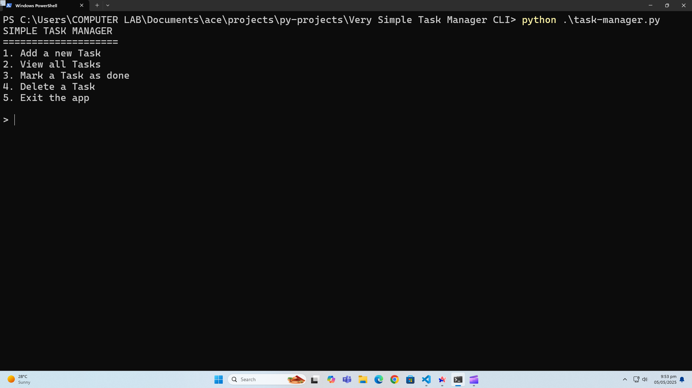
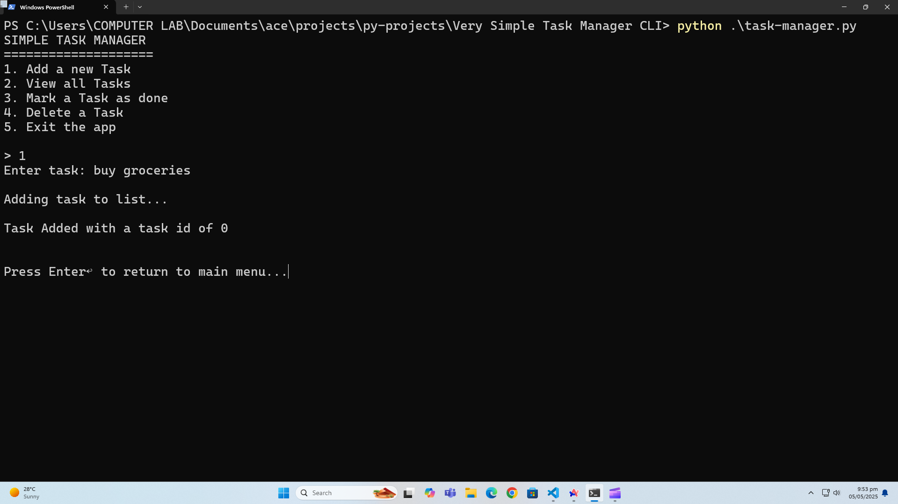
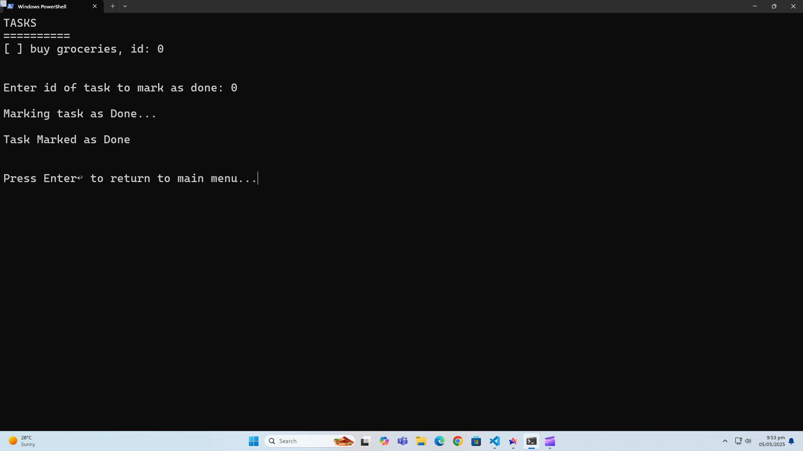
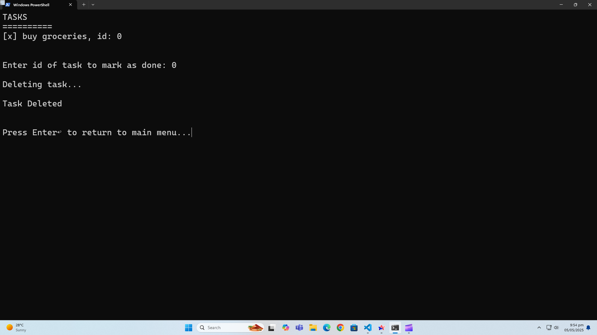

# 📝 Simple Task Manager

A **console-based Python application** for managing daily tasks.  
Built entirely with **Python fundamentals** — no external libraries, no file handling.

---

## 📌 Features

- ✅ Add a new task  
- 📋 View all tasks  
- ✔️ Mark a task as done  
- ❌ Delete a task  
- 🚪 Exit the app  

---

## ⚙️ Technologies & Concepts Used

- Python built-ins only (`input()`, `print()`, `lists`, `functions`, etc.)
- `os.system('cls')` for clearing screen (Windows only)
- `time.sleep()` for delay effects
- Basic error handling with `try-except`
- Console UI for user interaction

---

## 🧠 How It Works

- Each **task** is stored in a list as a string, followed by its **completion status** (`True` or `False`).
- Example list structure:
  ["Buy milk", False, "Read book", True]

* Task IDs are based on the **even index** of the task in the list.
* All user inputs are validated for:

  * Correct data type
  * Not empty
  * Valid task ID (even index only)

---

## ▶️ Getting Started

### Run the App

```bash
python task_manager.py
```

> Make sure you're using a **Windows terminal** (for `cls` to work) or replace `cls` with `clear` for Linux/Mac.

---

## 🧹 Sample Task Flow

1. Add a task — user enters non-empty string.
2. Task is added with default status `[ ] Not Done`.
3. Mark it done — user enters valid **even-numbered ID**.
4. Task is updated to `[x] Done`.
5. Deleting removes both task and its status from the list.

---

## 🔓 No External Dependencies

This project uses:

* No packages
* No files or databases
* Just core Python logic — great for learning!

---

## 🧑‍💻 Perfect For

* Beginners learning Python
* Practicing with:

  * `while` loops
  * `try-except`
  * `lists`
  * Simple logic building

---

## 📸 Demo

### 🧩 Main Menu


### 🧩 Adding a Task


### 🧩 Marking a Task


### 🧩 Delete a Task


### 💻 Terminal Demo


---

## ✅ To-Do / Ideas for Future

* [ ] Save tasks to file (persistence)
* [ ] Support task priority
* [ ] Deadline reminders
* [ ] Improve UI for non-Windows terminals

---

## 📄 License
This project is open for learning and modification. No license restrictions.
